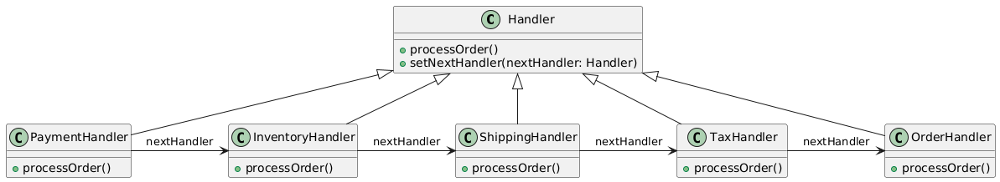

# Chain of responsibility

## Problem
Handle requests in a system where multiple objects can handle the request, but it's not known which one will handle it.

## Intent
Allow multiple objects to handle a request, each processing it in a specific way, without specifying which object will handle it.

## Example

* Online Shopping Order Processing

#### Handlers:
__PaymentHandler__: Checks if the payment method is valid (e.g., credit card, PayPal)
__InventoryHandler__: Checks if the product is in stock
__ShippingHandler__: Checks if the shipping address is valid and calculates shipping cost
__TaxHandler__: Calculates tax based on the shipping address
__OrderHandler__: Processes the order and sends a confirmation email

## Advantages:
* Decouples the sender of a request from its receiver
* Allows multiple objects to handle a request
* Provides flexibility in handling requests

## Disadvantages:
* Can lead to a long chain of handlers, making it difficult to debug
* If no handler can handle the request, it may not be properly handled

## Real world example:

Help Desk Ticket Resolution: In a help desk system, a support ticket is processed by a chain of handlers, each responsible for a specific step in the resolution process. For example:

* Handler 1: InitialReviewHandler (reviews ticket and assigns priority)
* Handler 2: TechnicalReviewHandler (technical review and troubleshooting)
* Handler 3: EscalationHandler (escalates ticket to higher-level support)
* Handler 4: ResolutionHandler (resolves ticket and sends resolution email)

## Resources
* [https://www.youtube.com/watch?v=gvIn5QBdGDk](https://www.youtube.com/watch?v=gvIn5QBdGDk)
* [https://www.youtube.com/watch?v=FafNcoBvVQo](https://www.youtube.com/watch?v=FafNcoBvVQo)
