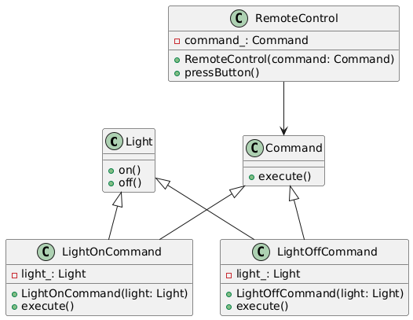

# Command

## Problem
Decouple the object that invokes an operation from the object that performs the operation.

## Intent
Encapsulate a request as an object, allowing the parameterization of clients with different requests, queue or log requests, and support undoable operations.

## Example
* Command pattern by creating a remote control that can turn a light on and off. 
* The Light class is the receiver, and the LightOnCommand and LightOffCommand classes are the concrete commands.
* The RemoteControl class is the invoker that executes the commands.

## Advantages
* Decouples the object that invokes an operation from the object that performs the operation.
* Enables queuing or logging of operations.
* Allows for parameterization of objects.

## Disadvantages
* Increases complexity with additional classes.

## Real life example
A remote control for a TV. The remote control (Invoker) sends commands (e.g., "Turn on") to the TV (Receiver), which performs the corresponding action. The Command pattern allows for different commands (e.g., "Turn off", "Change channel") to be added without modifying the TV or remote control.

## Resources
* [https://www.youtube.com/watch?v=E1lce5CWhE0](https://www.youtube.com/watch?v=E1lce5CWhE0)