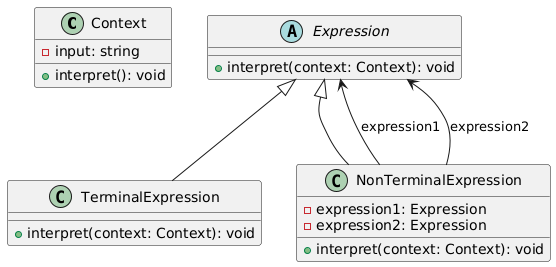
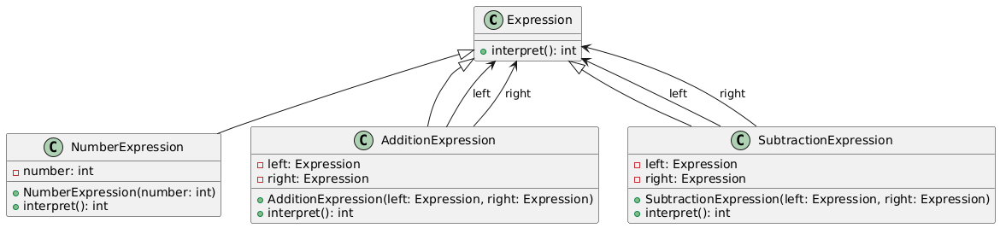

# Interpreter

## Problem
* To define a grammar for a simple language and implements an interpreter for that language.
* To provide a way to evaluate expressions or sentences written in a specific language.

## Intent
* The intent of the Interpreter pattern is to define a representation for a grammar along with an interpreter that uses the representation to interpret sentences in the language.

## Example
* Suppose we want to implement a simple calculator that can evaluate mathematical expressions like "2+3" or "5-2". 
* We can use the Interpreter pattern to define a grammar for these expressions and implement an interpreter to evaluate them.

## Advantages
* Allows for modular grammar implementation
* Easy to add new expressions or rules
* Interpreter can be used to evaluate expressions at runtime

## Disadvantages
* Can lead to complex code for large grammars
* May require significant memory for large expressions

## Real world example
* A SQL interpreter in a database management system. The SQL interpreter defines a grammar for SQL queries and evaluates them to produce results.

## Resources
* [https://www.youtube.com/watch?v=fFlPm0pzQYI](https://www.youtube.com/watch?v=fFlPm0pzQYI)