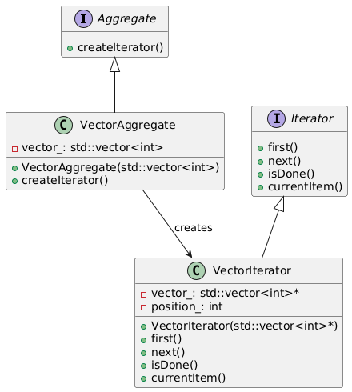

# Iterator pattern

## Problem
* Access each element without knowing the internal structure of the collection.
* Implement different traversal algorithms (e.g., linear, reverse, random access) without modifying the collection.
* Add or remove elements from the collection without affecting the traversal.

## Intent
* Provide a way to access the elements of an aggregate object (such as a collection or container) sequencially  without exposing its underlying representation.

## Example
* This code demonstrates the Iterator Pattern by creating a vector, implementing an iterator for it, and traversing the vector using the iterator.

## Advantages
* separates the iteration logic from the collection
* Allows for different traversal algorithms.
* Enables adding or removing elements without affecting the traversal.

## Disadvantages
* Increases complexity with additional classes (Iterator and Concrete Iterator).
* May lead to over-engineering if the collection is simple.

## Real-life Example: 
A playlist of songs. You can iterate through the songs using a playlist iterator, without knowing the internal structure of the playlist. You can also implement different traversal algorithms, such as playing the songs in reverse order or randomly.

## Resource
* [https://www.youtube.com/watch?v=X7shKHOaYtU](https://www.youtube.com/watch?v=X7shKHOaYtU)