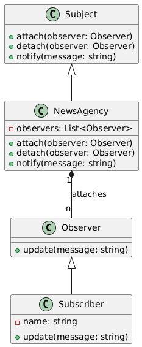

# Observer

## Problem
In a system, multiple objects need to be notified when a certain object changes its state.

## Intent
Define a one-to-many dependency between objects so that when one object changes state, all its dependents are notified.

## Example
A news agency (subject) has multiple subscribers (observers). When the news agency receives new news, it notifies all its subscribers.

## Advantages
* Loose Coupling: The subject and observers are decoupled, allowing for easy addition or removal of observers.
* Scalability: Multiple observers can be added or removed without modifying the subject.

## Disadvantages
* Overhead: Maintaining a list of observers can add overhead.
* Notification Overhead: Notifying all observers can be costly.

## Real-world Scenarios:
* Social media platforms: When a user posts an update, their followers are notified.
* Stock market: When a stock price changes, all interested parties are notified.

## Additional Notes
* Push vs. Pull: In the example above, the subject pushes the news to the observers. Alternatively, observers can pull the news from the subject.
* Synchronous vs. Asynchronous: Notifications can be sent synchronously or asynchronously, depending on the requirements.
                    
## Resources:
* [https://www.youtube.com/watch?v=Ep9_Zcgst3U](https://www.youtube.com/watch?v=Ep9_Zcgst3U)