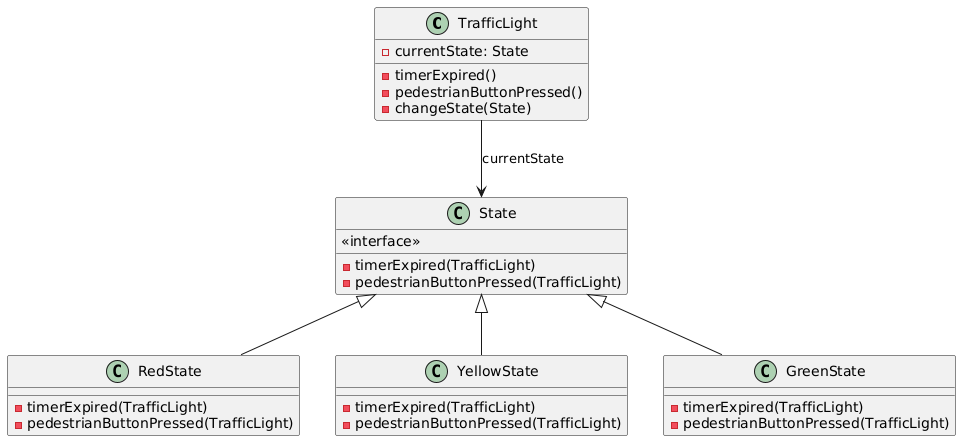

# State

## Problem
An object's behavior depends on its state, and the state changes at runtime. This leads to complex conditional statements and rigid code.

## Intent
Allow an object to change its behavior when its internal state changes.

## Example
A traffic light control system that changes its behavior based on the current state (red, yellow, green). Each state has specific behavior, such as:
* Red: Stop traffic
* Yellow: Prepare to stop
* Green: Allow traffic
The State pattern allows the traffic light control system to change its behavior seamlessly based on the current state, making it more efficient and maintainable.

* here traffic light's behaviour depends on its state and delegate task to corresponding state.

## Advantages
* Allows for easy addition of new states without modifying existing code.
* Encapsulates state-specific behavior, making the code more modular and maintainable.
* Reduces conditional statements and makes the code more readable.

## Disadvantages
* Increases the number of classes and objects, which can lead to complexity.
* Can lead to over-engineering if the number of states is small.

## Real life example

A vending machine that dispenses products based on the selection made by the customer. The vending machine has different states, such as:
* No selection made (initial state)
* Selection made, but not paid for
* Paid for, but not dispensed
* Dispensed

## Resources

* [https://www.youtube.com/watch?v=abX4xzaAsoc](https://www.youtube.com/watch?v=abX4xzaAsoc)
* 