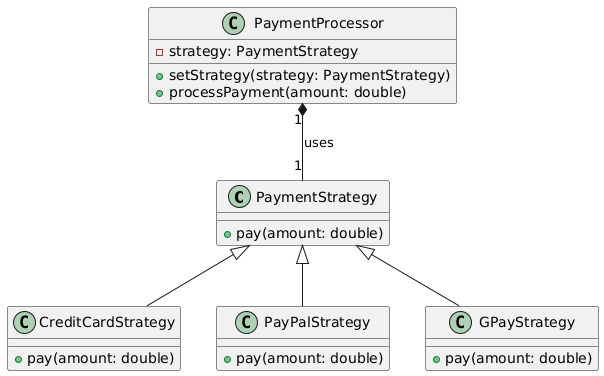

# Strategy pattern

## Problem
* You have multiple algorithms or behaviors that need to be used interchangeably.
* You want to decouple the client code from the specific algorithm implementation.

## Intent
* Define a family of algorithms, encapsulate each one, and make them interchangeable
* Allow the algorithm to vary independently from clients that use it.

## Example
Suppose we have a payment processing system that needs to support different payment methods (credit card, PayPal, GPay).

## Advantages
* Client can change algorithms dynamically (data driven)
* Decoupling: Client code is decoupled from the specific algorithm implementation.
* Flexibility: Easy to add or remove algorithms without changing the client code.
* Reusability: Algorithms can be reused across multiple contexts.

## Disadvantages
* Increased complexity: More classes and interfaces to manage.
* Overhead: Strategy objects need to be created and managed.

## Real-world examples
* Payment processing systems (as in the example)
* Sorting algorithms (e.g., quicksort, mergesort, heapsort)
* Encryption algorithms (e.g., AES, RSA, SHA)

## Resources
* [https://www.youtube.com/watch?v=u8DttUrXtEw](https://www.youtube.com/watch?v=u8DttUrXtEw)