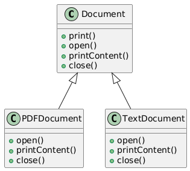
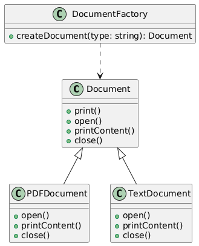

# Template

## Problem
* You want to implement an algorithm that has a fixed structure, but some steps may vary depending on the subclass.
* You want to avoid code duplication and provide a way for subclasses to customize the algorithm.

## Intent
* Define a template method that provides a way to perform a sequence of operations.
* Allow subclasses to override certain steps of the algorithm without changing the overall structure.

## Example
* Suppose we have a class Document that needs to be printed. The printing process involves several steps: opening the document, printing the content, and closing the document. We can use the Template Method Pattern to define the printing algorithm.

## Advantages
* Provides a way to customize the algorithm without changing its structure.
* Avoids code duplication by providing a common implementation for the algorithm.
* Allows for flexibility and extensibility.

## Disadvantages
* Can be overused, leading to complex and rigid designs.
* May lead to code duplication if not implemented carefully.

## Real-life examples
* Printing documents (as in the example)
* Data encryption and decryption
* File compression and decompression
* Database queries and transactions

## Additional Points:
* The template method pattern is often used in combination with other design patterns, such as the Factory Method Pattern.

* It's essential to balance flexibility and complexity when using this pattern. 

## Resource

* [https://www.youtube.com/watch?v=kwy-G1DEm0M](https://www.youtube.com/watch?v=kwy-G1DEm0M)