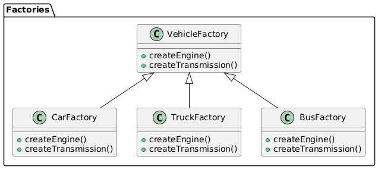
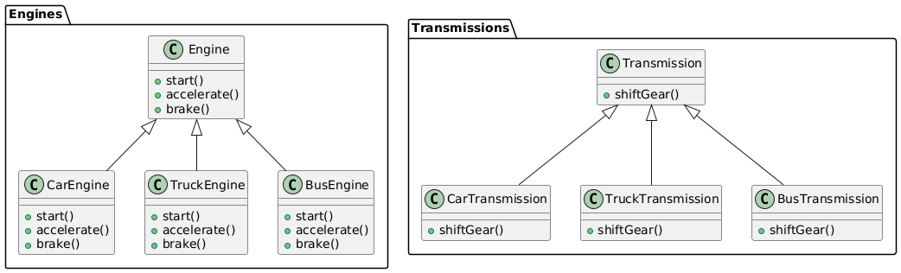

# Abstract factory

## Problem
* Creating objects(Vehicle, Engine, Brakes, Transmission) that belong to multiple families(Car, Truck, Bus) or classes
* When variations of multiple products needs to be created

## Intent
* Provide an interface for creating families of related or dependent objects without specifying their concrete classes.
* To create factory of factories: a factory that groups the individual but related/dependent factories together without specifying their concrete classes.

## Example

* Abstract Factories
    * VehicleFactory (abstract factory for vehicles)
    * Engine (abstract factory for engines)
    * Transmission (abstract factory for transmissions)
* Concrete Factories
    * CarFactory (concrete factory for cars)
    * TruckFactory (concrete factory for trucks)
    * BusFactory (concrete factory for buses)
* Abstract Products
    * Engine (abstract product for engines)
    * Transmission (abstract product for transmissions)
* Concrete Products
    * CarEngine (concrete product for car engines)
    * TruckEngine (concrete product for truck engines)
    * BusEngine (concrete product for bus engines)
    * CarTransmission (concrete product for car transmissions)
    * TruckTransmission (concrete product for truck transmissions)
    * BusTransmission (concrete product for bus transmissions)

## SOLID Principle
* 

## Advantages

* Encapsulates object creation
* Promotes consistency
* Provides flexibility to create differenct objects
* Makes code easy to understand
* Improve scalability: New type of object can be added easyly

## Disadvantages

* complex to implement, especially for large systems.
* It may lead to over-engineering

## Difference b/w factory and abstract factory

**Factory Pattern:**
* Creates objects without specifying the exact class
* Returns a single product object
* Typically used when you have a single product with multiple implementations
* Example: A vehicle factory that creates different types of vehicles (cars, trucks, buses)

**Abstract Factory Pattern:**
* Creates families of related objects without specifying their concrete classes
* Returns multiple product objects that are related to each other
* Typically used when you have multiple products that need to be created together
Example: A vehicle factory that creates a family of related objects, such as a car with its engine, transmission, and brakes.

## Resources

* [https://www.youtube.com/watch?v=QNpwWkdFvgQ](https://www.youtube.com/watch?v=QNpwWkdFvgQ)
* 

