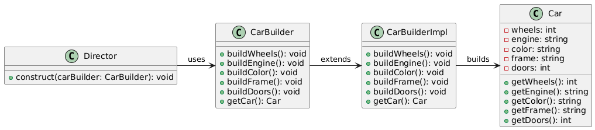

# Builder pattern

## Problem

* Constructing complex objects with multiple components or attributes
* _Separating the construction process from the object's representation_ (If complex construction is within object representation, object code will be hard to read and lengthy).
* Construction process is repetitive or has many variations
* If recursive construction required for ex. Binary Tree

## Intent

*   The intent of the Builder pattern is to separate the construction of a object from its representation, allowing for more flexibility and reuse.

## Example

* [main.cpp](./main.cpp)
* Vehicle class
* VehicleBuilder
* CarBuilder : VehicleBuilder
* Director

## Advantages

* **Seperation of concern:** The CarBuilder class separates the construction of a Car object from its representation, making easy to read and update construction without changing original class.
* **Improved readability**
* **Increases reusability:** Car object can be created multiple times without code duplication.
* 

## Disavantages

* **Overhead:** The pattern requires the creation of additional classes (e.g., CarBuilder and Director), which can add overhead.
* **Increased Complexity:** The Builder pattern can introduce additional complexity, especially for simple objects.
* **Limited Applicability:** The Builder pattern is most suitable for complex objects with multiple attributes, and may not be necessary for simple objects.

