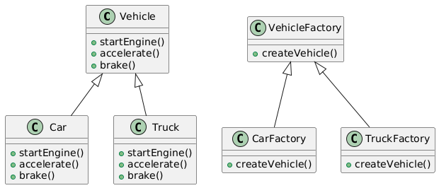

# Factory

## Problem
* Clients want to create objects without knowing the details of their creation
* Creating objects can be complex and involve multiple steps
* Objects can have varying properties and behaviors

## Intent
* Define an interface for creating objects
* Let subclasses decide which class to instantiate
* Provide a way to create objects without specifying the exact class

## Example
* VehicleFactory (interface): defines the createVehicle() method
* CarFactory (concrete factory): implements createVehicle() to create Car objects
* TruckFactory (concrete factory): implements createVehicle() to create Truck objects
* Vehicle (product): the abstract product class
* Car (product): a concrete product class
* Truck (product): a concrete product class

## Advantages
* Encapsulates object creation
* Provides a way to create objects without knowing the details of their creation
* Allows for run time polymorphism

## Disadvantages
* Can lead to complexity
* Can be overkill for simple object creation

## Resources

* [https://www.youtube.com/watch?v=Z1MNtyi_bYw](https://www.youtube.com/watch?v=Z1MNtyi_bYw)
* [https://medium.com/@antwang/factory-method-in-c-the-right-way-e8c5f015fe39](https://medium.com/@antwang/factory-method-in-c-the-right-way-e8c5f015fe39)
* [https://www.youtube.com/watch?v=tAuRQs_d9F8&t=47s](https://www.youtube.com/watch?v=tAuRQs_d9F8&t=47s)