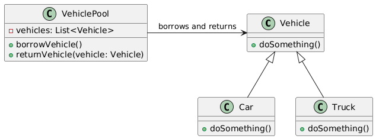

# Object pool

## Problem
* Creating and managing objects can be expensive in terms of memory and computation.
* Objects are often used briefly and then discarded.

## Intent
* To reduce the cost of creating and managing objects by reusing existing objects.
* To implement object caching or object sharing.

## Example
* VehiclePool
* Vehicle

## Advantages
* Reduces the cost of creating and managing objects.
* Improves performance by reusing existing objects.
* Can be used to implement vehicle caching or object sharing.

## Disadvantages
* Complex to implement in some cases

## Resources