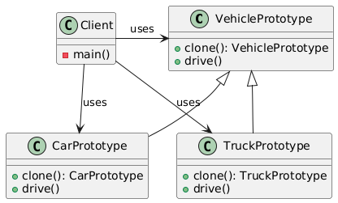

# Prototype pattern

## Problem

* Creating a new object can be expensive or complex.
* You want to minimize the cost of creating new objects.

## Intent

* Create new objects by copying the prototype.

## Example
VehiclePrototype (abstract class)
CarPrototype (concrete class)

## Advantages
* Reduces the cost of creating new objects.
* Allows for the creation of new objects without knowing their concrete classes.
* Can be used to implement object caching or object pooling.

## Disadvantages
* Can be complex to implement.
* May lead to issues with object identity and equality.