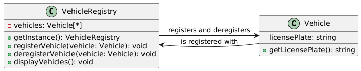

# Singleton

## Problem
Ensuring that only one instance of a class is created, and providing a global point of access to that instance.

## Intent
The intent of the Singleton pattern is to ensure that only one instance of a class is created, and to provide a way to access that instance globally.

## Example

* [main.cpp]()
* Vehicle
* VehicleRegistry

## Advantages

* Ensures only one instance of the VehicleRegistry class is created and object can be reused
* Lazy initialization (instance is created only when needed)
* Provides a global point of access to the instance

## Disadvantages
* Can lead to tight coupling between classes that use the VehicleRegistry instance
* Can be difficult to implement correctly in multi-threaded environments
* Can make unit testing more difficult

## Resources

* [https://www.youtube.com/watch?v=PPup1yeU45I](https://www.youtube.com/watch?v=PPup1yeU45I)