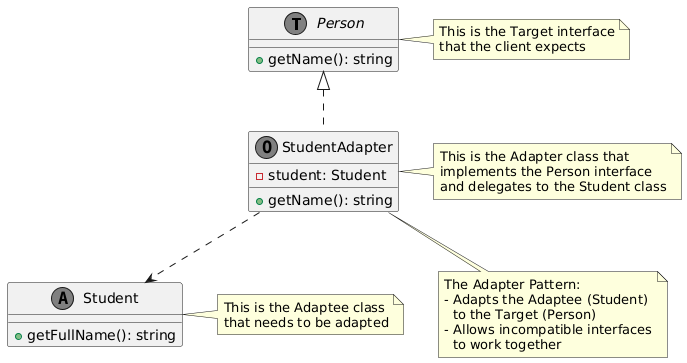

# Adapter

## Problem
Incompatible interfaces between classes or systems, making it difficult to integrate or reuse existing code.

## Intent
Provide a bridge between two incompatible interfaces, allowing them to work together seamlessly.

## Example

* The University has a legacy system that uses a Student class with a getFullName() method, but the new system requires a getName() method. We need to adapt the Student class to work with the new system.
* Person
* Student
* StudentAdapter

## Advantages
* Allows integration of legacy code or third-party libraries without modifying their source code.
* Allows incompatible classes to work together
* Increases reusability of existing code
* Provides a flexible way to integrate new classes or systems

## Disadvantages
* Can add complexity to the system
* May require additional maintenance

**Real-World Analogy:**
Think of a power adapter you use while traveling. If your device has a plug that doesn’t fit the local sockets, you use a power adapter to convert the plug shape, allowing your device to connect to the local power source.

**Key Points:**
* The Adapter Pattern provides a bridge between two incompatible interfaces
* The adapter implements the target interface and delegates calls to the adaptee
* Allows for flexibility and reusability in system design
* It can be implemented in two ways: Class Adapter (uses inheritance) and Object Adapter (uses composition).

## Resource

* [https://www.youtube.com/watch?v=BLaz_Nct1eI](https://www.youtube.com/watch?v=BLaz_Nct1eI)
* 