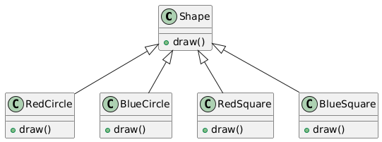
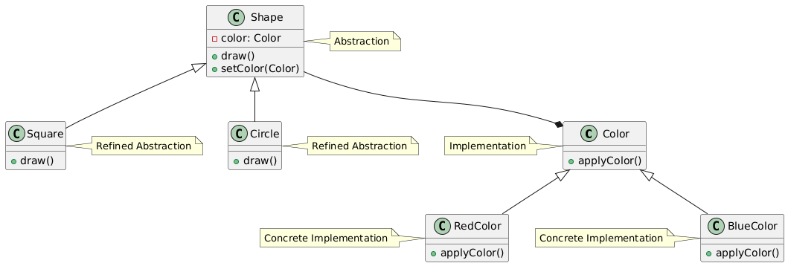

# Bridge

## Problem
Separating an object's abstraction from its implementation, allowing for more flexibility and extensibility.

## Intent
Decouple an object's abstraction (interface) from its implementation (concrete class), so that the two can vary independently.

## Example
* Shape
* Rectangle
* Circle
* Color
* RedColor
* BlueColor

The code demonstrates the Bridge pattern by separating the Shape abstraction from its Color implementation. You can vary the color of a shape without changing its class, and vice versa.

Without Bridge pattern

With Bridge pattern

## Advantages
* Separates abstraction from implementation, allowing them to vary independently.
* Increases flexibility and scalability by allowing new shapes or colors to be added without modifying existing code.
* Reduces the number of subclasses needed.
* Improves code organization and structure.

## Disadvantages
* Can be more complex to implement than other patterns.
* May lead to an explosion of classes if not used carefully

## Real world scenarios
Graphics editors: The Bridge pattern can be used to separate the shape (abstraction) from the color (implementation).
Database access: The Bridge pattern can be used to separate the database access (abstraction) from the database driver (implementation).

## Resources

* [https://www.youtube.com/watch?v=SOw1_W0taBg](https://www.youtube.com/watch?v=SOw1_W0taBg)
* [https://www.youtube.com/watch?v=88kAIisOiYs](https://www.youtube.com/watch?v=88kAIisOiYs)
