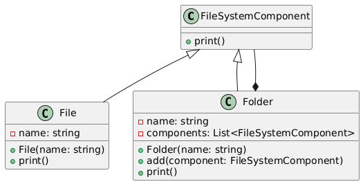

# Composite(Tree pattern)

## Problem
*  Create a tree-like structure where some objects can have child objects, and some objects can have parent objects(leaf node)
* How to treat individual objects and composite objects uniformly?

## Intent
* Compose objects into a tree structure to represent part-whole hierarchies
* Allow clients to treat individual objects and composite objects uniformly

## Example
* File system structure with folders and files. Folders can have another folders or files inside it.
* FileSystemComponent
* File
* Folder

## Advantages
* Treats individual objects and compositions of objects uniformly(Difference b/w normal tree and composite pattern)
* Enables creating a tree-like structure where some objects can have child objects, and some objects can have parent objects.
* Reduces code complexity by avoiding type checking and downcasting.
* Simplifies client code
* Provide extensibility, leaf node or other composite node can be added when needed
* 

## Disadvantages
* Can lead to a deep nesting of objects, which can be difficult to manage.
* It can be difficult to enforce constraints on which components can be added to composites. This can lead to invalid structures if the pattern is not properly managed.
* Can lead to a complex implementation if not used carefully.

## Resources

* [https://www.youtube.com/watch?v=FLkCkUY7Wu0](https://www.youtube.com/watch?v=FLkCkUY7Wu0)
* 