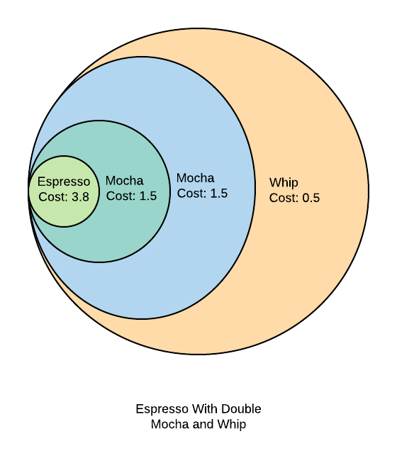
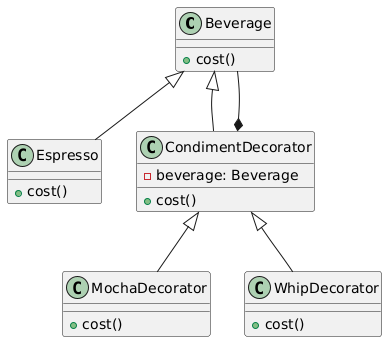

# Decorator

## Problem
* Extending the behavior of an object using subclassing is inflexible(Need to generate class for all combinations of functionality)
* Dynamically adding additional responsibilities to an object affects its external interface.

## Intent
* To attach additional responsibilities to an object dynamically.
* To provide a flexible alternative to subclassing for extending functionality.

## Example

## Advantages
* Allows for dynamic addition of responsibilities
* Provides a flexible alternative to subclassing
* Enables wrapping of objects without affecting their external interface

## Disadvantages
* Can lead to increased complexity
* May result in a large number of small classes

## References

* [https://www.youtube.com/watch?v=w6a9MXUwcfY](https://www.youtube.com/watch?v=w6a9MXUwcfY)