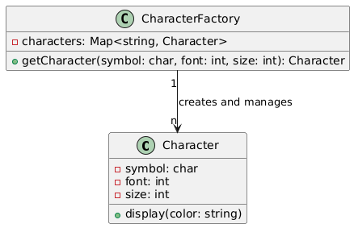

# FlyWeight

## Problem
* Managing a large number of similar objects that share common data
* Reducing memory usage and improving performance

## Intent
* Use sharing to support a large number of fine-grained objects
* Reduce the cost of creating and managing multiple objects

## Example
In code, The Character class contains both intrinsic data (symbol, font, and size) and extrinsic data (color). The display method takes the extrinsic data (color) as a parameter and displays all the data. The CharacterFactory class acts as a flyweight factory, creating and managing instances of the Character class based on the intrinsic data. The getCharacter method returns a shared instance of the Character class based on the given symbol, font, and size.
Note that the extrinsic data (color) is passed to the display method each time it is called, demonstrating the separation of intrinsic and extrinsic data in the Flyweight pattern.

## Advantages
* Reduces memory usage by sharing common data
* Improves performance by reducing the number of objects created and managed

## Disadvantages
* Can be complex to implement, especially in cases where the shared data is mutable
* May require additional overhead to manage the shared data

## Resources

* [https://www.youtube.com/watch?v=Mwm6tB3x1do](https://www.youtube.com/watch?v=Mwm6tB3x1do)