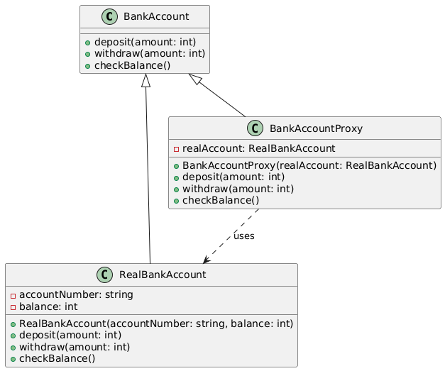

# Proxy

## Problem
* Controlling access to a complex or expensive object
* Providing a surrogate for an object that is difficult to create or access

## Intent
* Provide a surrogate or placeholder for another object to control access to it
* Use a proxy object to perform additional tasks before or after accessing the real object

## Example
* ThE code demonstrates the Proxy design pattern by creating a BankAccountProxy class that acts as an intermediary between a RealBankAccount object and the client code. The proxy controls access to the real object by limiting the withdrawal amount to 1000. If the withdrawal amount exceeds this limit, the proxy prints an error message.

## Advantages
* Controls access to the object, Enhances security by controlling access
* Helps with pre-processing & post processing
* Improves performance by delaying object creation or access
* Provides a layer of abstraction

## Disadvanatges
* Additional complexity
* Overhead of creating and managing the proxy object

## Real life examples:
* A proxy server that acts as an intermediary between a client and a server
* A representative that acts on behalf of a celebrity or businessperson
* Samsung is using proxy to restrict chatgpt access

## Resources

* [https://www.youtube.com/watch?v=9MxHKlVc6ZM](https://www.youtube.com/watch?v=9MxHKlVc6ZM)